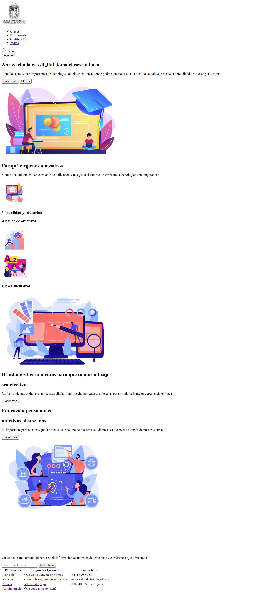

<h1>Taller 9: Diomedes Diaz Vera</h1>

<h2>Información</h2>

Curso: Full Stack Basico - Grupo 1

Profesor: Cristian Patiño

<h2>Punto 1: Link Figma</h2>
<a href="https://www.figma.com/file/OW2tXALzQi9HhC2obXZ3dv/Diomedes?type=design&node-id=15-97&t=YKO9K9k1QJ5K6n8e-0">Link de Figma</a>
<h2>Link Página Web Github</h2>
<a href="https://diomodiaz.github.io/taller-9-full-stack/">Link Página Web</a>

<h2>Punto 2: HTML</h2>

<h2>Punto 3: CSS</h2>
